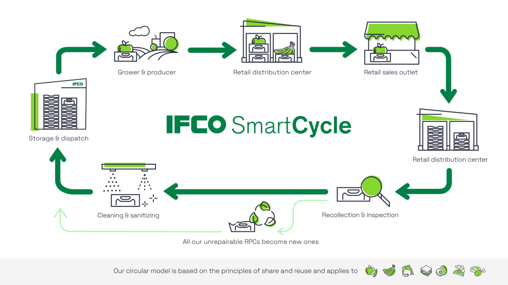

# IFCO Data Science Challenge

  

## Problem Statement

The [IFCO Smart Cycle(tm)](https://www.ifco.com/the-ifco-way/ifco-smartcycle/) describes how IFCO [RPCs (Reusable Packaging Containers)](https://www.ifco.com/explore-our-products/) move throught the food supply chain.

Each time an RPC is send out from an IFCO Service Center (SC), it starts a new trip.

Assume the true mean of trip durations being 100 days.

A key task to ensure the IFCO SmartCycle is efficient is to understand how many RPCs are being lost over a period of time so the pool can be replenished appropriately. The probability that an RPC is lost during a trip is called shrinkage rate.

The methods applied to do this vary and complement each other. For the sake of simplicity, we concentrate on asset based methods in this challenge.

Assume we can measure the rental date when an asset leaves an SC.

- Scenario one: Assume we can measure the rental date for 100% of trips.
- Scenario two: Assume we can only measure the rental date a percentage of trips, substantially smaller than 100%.

Your stakeholder tasks you with the following question, underlying scenario one:

- Develop a model to estimate the shrinkage rate, i.e. the probability of an asset not returning from a trip
- Develop a model to estimate the pool size, i.e. the amount of assets available to IFCO at a given time.

## Questions / Hints

- Illustrate your approach and ideas, possibly using simulated data.
- Clearly mark your assumptions and reflect on risks that may impact your model.
- Assume your audience contains non-tech managers but be prepared to illustrate your approach to fellow data scientists reviewing your work.
- How are shrinkage rate and pool size related?
- Bonus: How would switching to scenario two change your approach, which limitations would be introduced?

## Additional Instructions

1. **Deliverables**
   - Turn in your all materials, code, presentation or visualization, Github is preferred.
   - Enclose clear instructions how to consume the material and how to reproduce your results.
2. **Evaluation**: Your solution will be evaluated on accuracy, efficiency and clarity.
